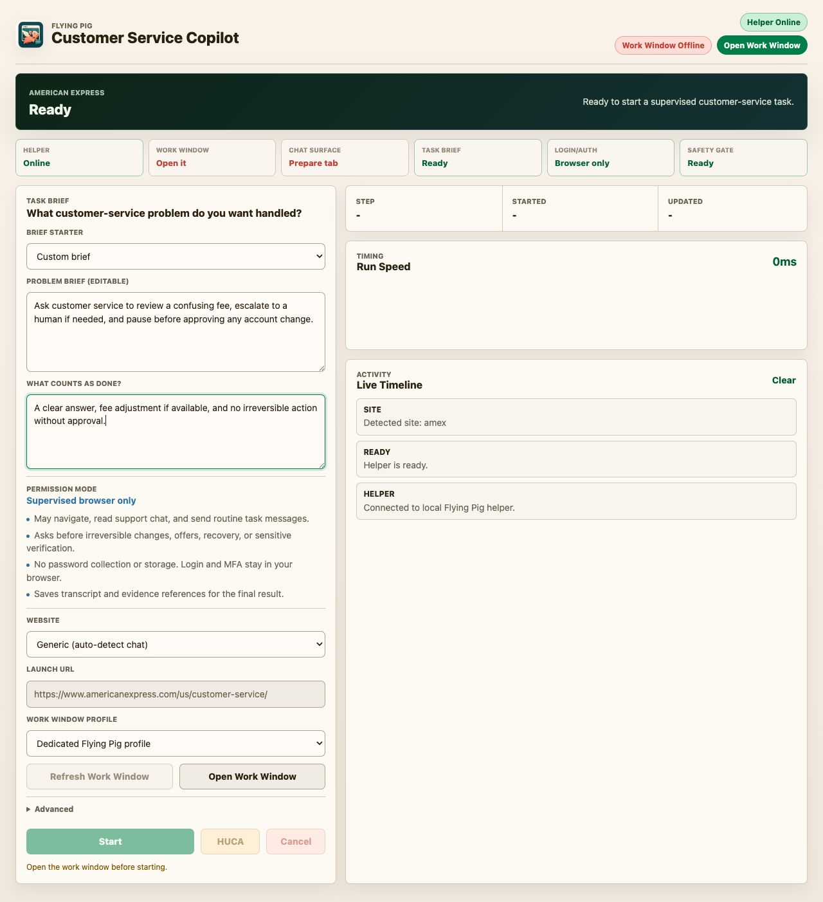
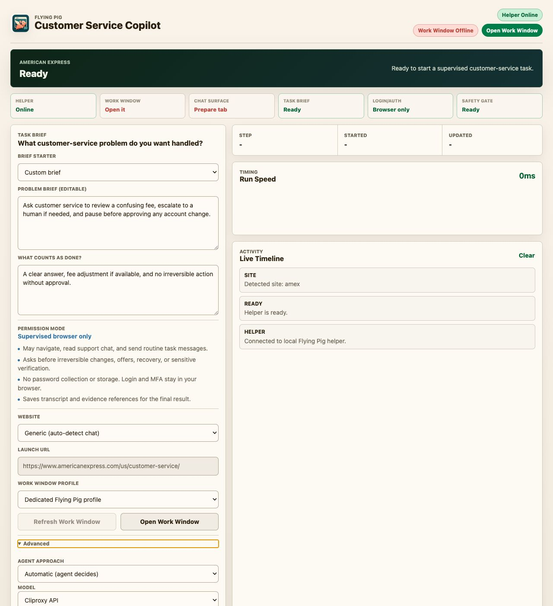
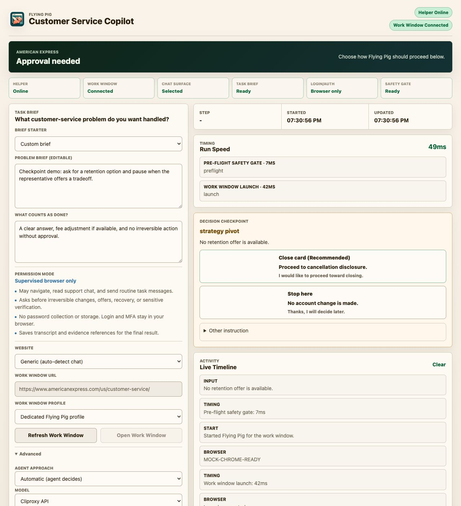

# Flying Pig 1.0.1 发布说明：Mac 桌面版

这次发布把 Flying Pig 从开发者工具推进到可以直接试用的 Mac 桌面应用。用户下载 zip、打开 app，就能在一个桌面控制台里启动本地 helper、打开受控浏览器窗口，并监督 AI 处理客服聊天。

## 这次发布了什么

- **Mac 桌面安装包**：发布 `Flying Pig-1.0.1-arm64-mac.zip`，面向 Apple Silicon Mac。桌面壳会自动启动和停止本地 helper，普通用户不需要手动运行 `flyingpig-helper` 或打开 localhost 页面。
- **新的客服任务控制台**：界面改成浅色、密度更高的 cockpit，第一屏突出任务描述、准备状态、Work Window、时间线和运行速度，而不是暴露底层自动化细节。
- **自动选择 Agent Approach**：主流程默认让 agent 自动选择处理策略；手动模板选择已经收进 Advanced，避免用户一开始就被“Playbook”概念打断。
- **受控 Work Window**：桌面 app 负责打开 Flying Pig 工作浏览器窗口，用户在里面登录、找到客服入口，AI 只在这个窗口内执行任务。
- **人工监督和安全边界**：不可逆操作、接受 offer、恢复策略、敏感验证等时刻会暂停并要求用户确认；登录和 MFA 仍然留在用户浏览器内完成，不收集密码。
- **Decision Checkpoint**：当客服给出方案或出现关键决策时，界面会展示可选动作、推荐项和将要发送的确切消息。
- **Run Speed 和时间线**：运行阶段会显示 PII-free 的耗时摘要，帮助用户理解时间花在启动、pre-flight、模型规划、等待客服等哪里。

## 截图

## 下载和安装

1. 在 GitHub Release 下载 `Flying Pig-1.0.1-arm64-mac.zip`。
2. 解压后打开 `Flying Pig.app`。
3. 如果 macOS 提示应用未签名，请右键点击 app，选择 **Open**，再确认打开。
4. 在 app 里点击 **Open Work Window**，登录目标网站并打开客服入口，然后填写任务目标并启动。

## 需要提前说明

- 这版 Mac 包还没有 Developer ID 签名，因此第一次打开需要手动通过 Gatekeeper。
- 真实 Amex 冒烟测试仍需要测试者在场处理登录、MFA 和明确发送/批准时刻。
- 当前版本是监督式客服自动化：AI 可以导航、阅读客服聊天、发送常规任务消息；账号变更、接受 offer、恢复重开聊天等关键动作必须经过用户确认。

## 校验信息

- Source bundle: `flyingpig-beta-1.0.1.zip`
- Mac desktop package: `Flying Pig-1.0.1-arm64-mac.zip`
- 发布前验证：lint、非 slow Python 测试、dashboard smoke、desktop smoke、helper sidecar build、desktop packaging、release artifact scan。
